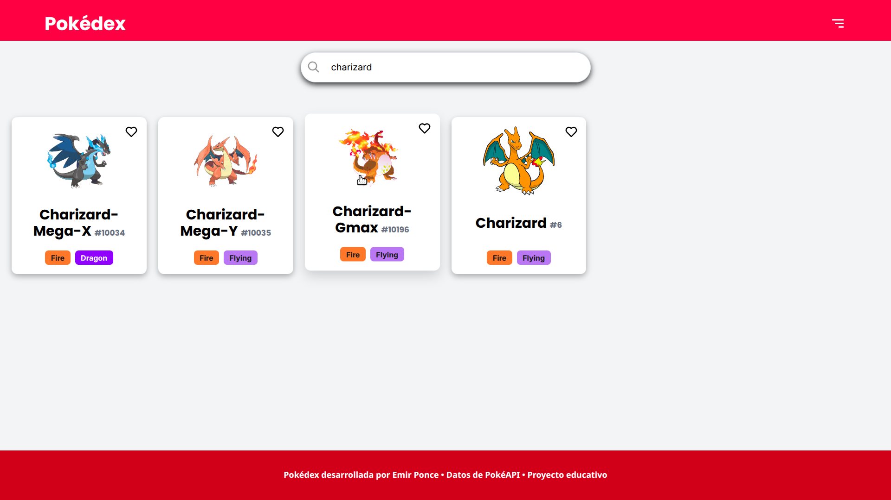

# Pokédex

Pokédex Online desarrollada solo con JavaScript Vanilla y Anime.js (librería de animaciones). \
El proyecto me sirvió para entender DOM Scripting y experimentar la dificultad de tener todo en un solo archivo. También aprendí a reutilizar funciones que reciben argumentos diferentes sin que se rompa el código, y sobre todo, comprendí que con un framework hubiese sido más fácil el crear y mantener una pokédex.

## Demo

[Ver Demostración](https://pokedex-ponce.netlify.app/)

## Features

- Mostrar en la página principal las primeras 20 card de pokémon mediante paginación de la PokeAPI
- Buscar pokémon por nombre
- Filtrar pokémon por tipo
- Guardar pokémon favoritos en localStorage
- Mostrar un modal con las estadísticas base y las evoluciones del pokémon seleccionado

## Tech Stack

**Frontend Client-Side Application:** 
* 
* 
* 
* 

## Installation

Solo descargar el repositorio y ejecutar con el plugin Live Server para VSCode

    
## License

[MIT](https://choosealicense.com/licenses/mit/)

## Acknowledgements

 - [PokéAPI](https://pokeapi.co/)
 - [Inspiración](https://github.com/VichithLy/pokedex-vue-tailwindcss)
 - [Iconos](https://boxicons.com/)
 - [Más iconos](https://fontawesome.com/)
 - [anime.js](https://animejs.com/)